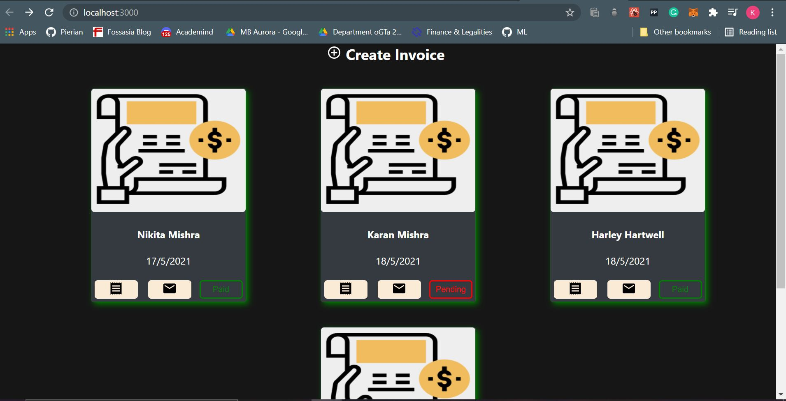
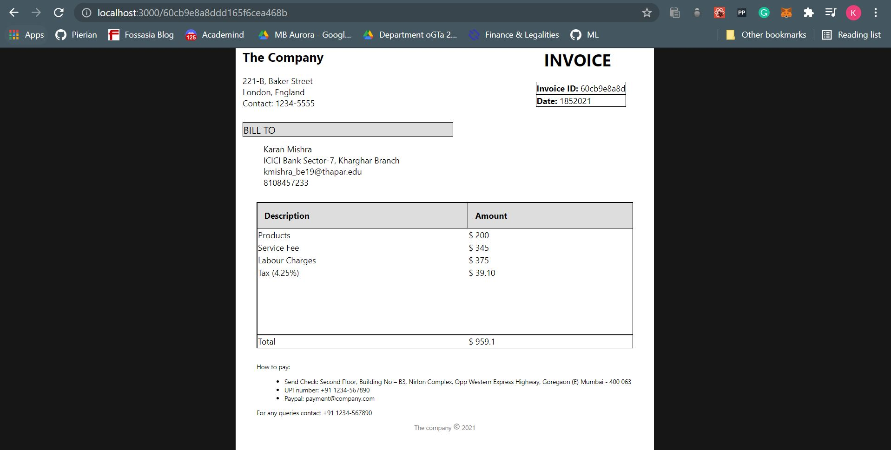
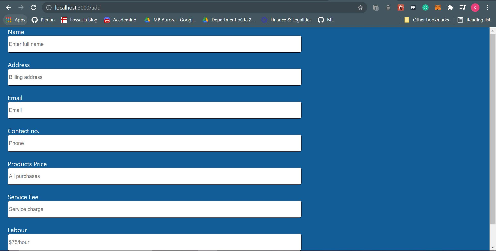

# Invoice Web App

Technologies and tools used:
1. ReactJS 
2. NodeJS (with Express)
3. MongoDB
4. CSS and Material-UI for design.

Steps to run: 
1. Download ZIP file to your local system and extract it.
2. cd into the main folder and run `npm i` to install all dependencies.
3. cd into the client folder and run `npm i` again.
4. Back to the main folder and run `npm run dev` to run the development server.
5. Open localhost:3000 if that does not happen automatically.

Features of the app:
1. On the home page all the invoice summaries can be viewed (see image 1). It includes the name, date of creation, status and the background(green/red) of the card indicates whether it's past the due date or not.
2. On each card the first button is the view button which takes you to another page where you can view the invoice in detail (see image 2)
3. The second button sends an email to the recepient informing the total amount. 
4. Finally there's a 'Create' button using which you can create an invoice using the form in image 3.

Demo images of the Web App: 

image 1

image 2

image 3

